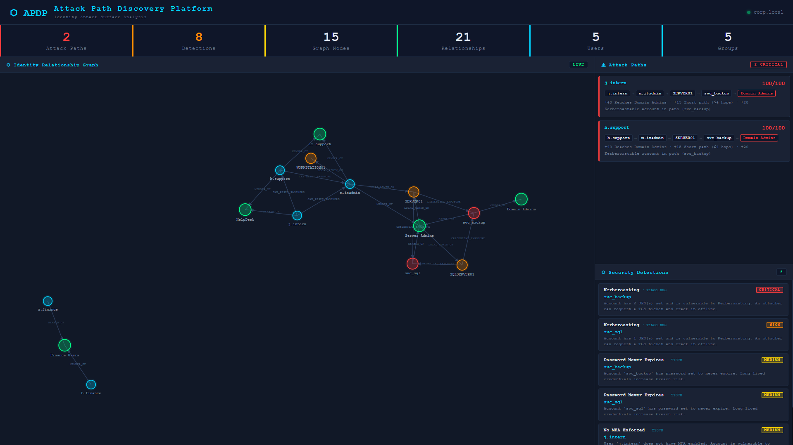
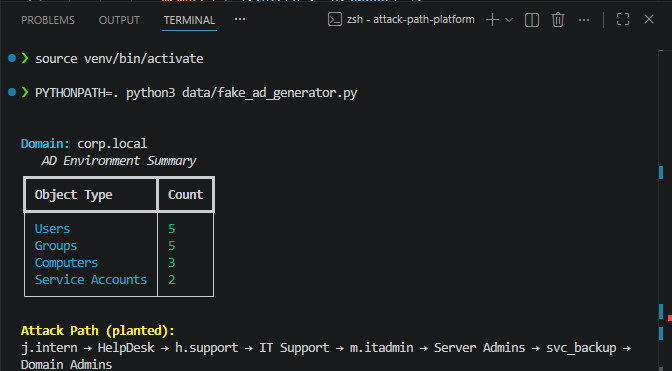
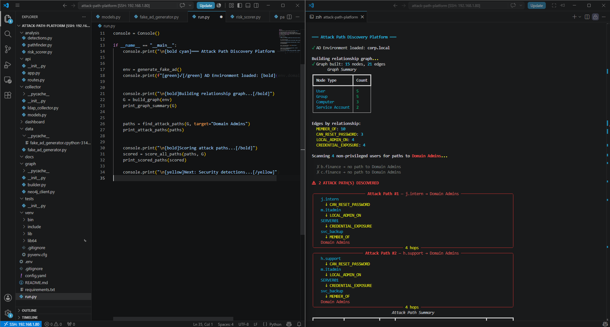
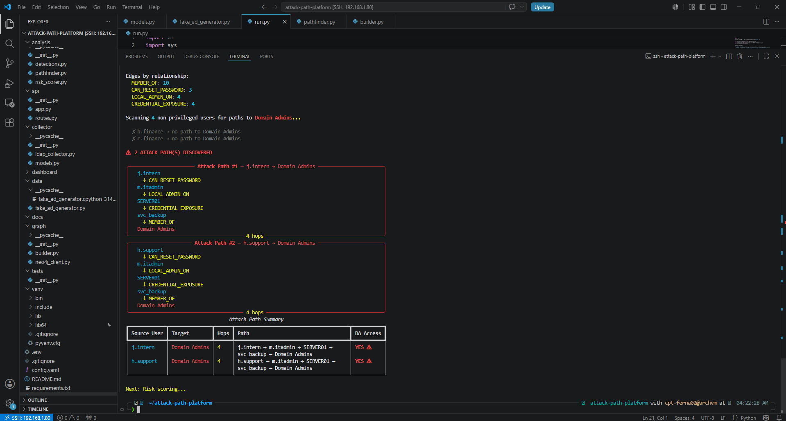
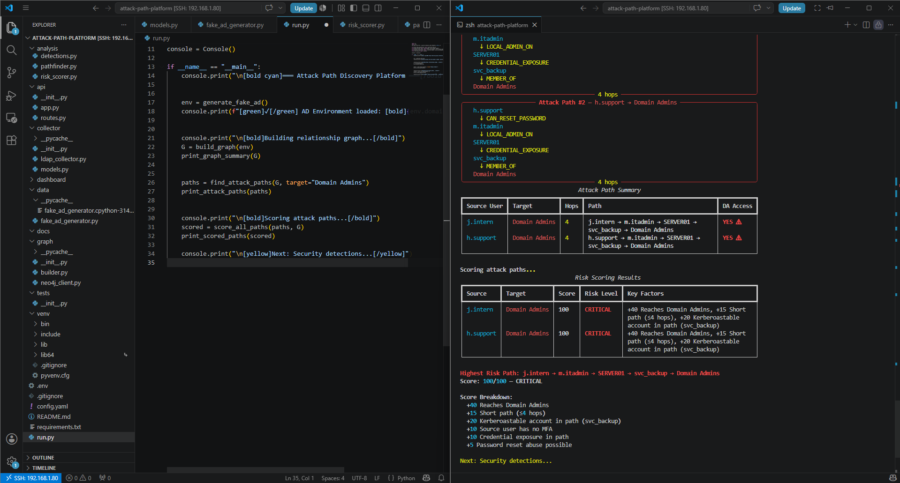
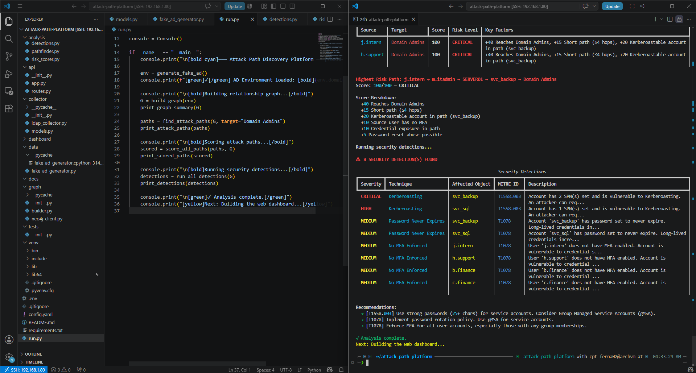
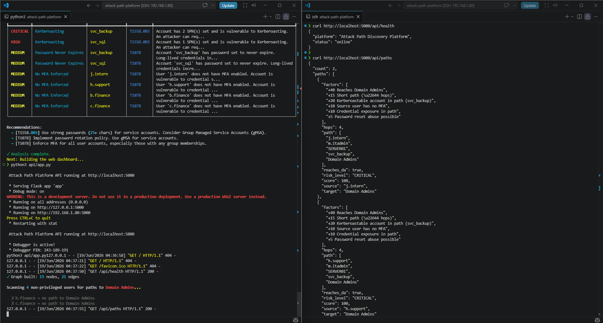
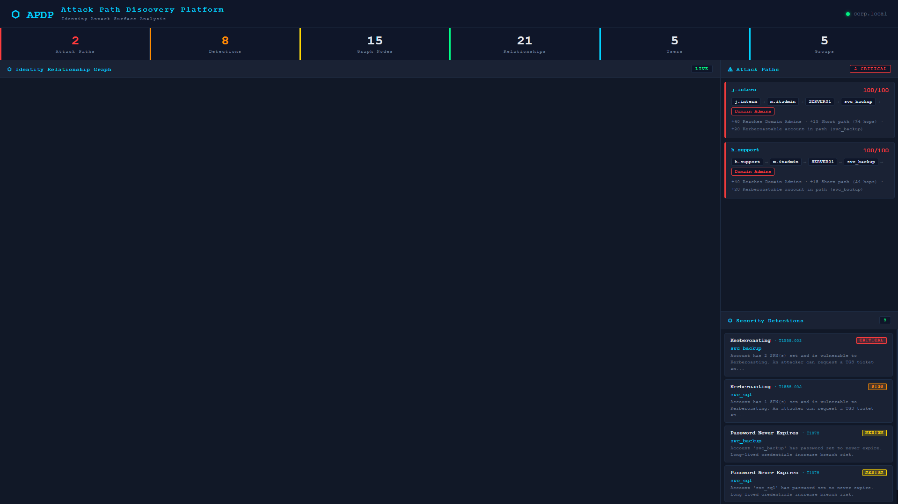

# ⬡ Attack Path Discovery Platform

<div align="center">


**Identity Attack Surface Analysis Platform**

*Discovers privilege escalation paths, Kerberoast opportunities, shadow administrators, and Domain Admin exposure through graph-based Active Directory analysis.*

[Demo](#demo) · [Architecture](#architecture) · [Features](#features) · [Installation](#installation) · [Challenges](#challenges--problem-solving)

</div>

---

## Demo

> ⬡ Full platform — graph engine, attack path discovery, risk scoring, and security detections running live.

[](https://youtu.be/2jjIKAi_7gY)

*Click the image to watch the full demo on YouTube*
---

## What Is This?

Most security tools find vulnerabilities. This tool finds **relationships**.

Given an Active Directory environment, it answers:

> *"If an attacker compromises a low-privileged user, can they reach Domain Admin?"*

**Example path discovered:**

```
j.intern
  ↓ CAN_RESET_PASSWORD
m.itadmin
  ↓ LOCAL_ADMIN_ON
SERVER01
  ↓ CREDENTIAL_EXPOSURE
svc_backup
  ↓ MEMBER_OF
Domain Admins

Risk Score: 100/100 — CRITICAL
```

A low-privilege intern account reaches Domain Admin in **4 hops**. Traditional audits miss this entirely.

Designed to model real-world Active Directory privilege relationships and identify high-risk attack paths through graph-based analysis.

---

## Features

- **Graph-Based AD Analysis** — Models users, groups, computers, and service accounts as a directed graph with typed relationship edges
- **Attack Path Discovery** — BFS shortest-path algorithm finds all routes from unprivileged users to Domain Admin
- **Risk Scoring Engine** — Weighted scoring (0–100) based on path length, Kerberoastable accounts, MFA status, and credential exposure
- **Security Detections** — Automated detection of Kerberoasting (T1558.003), Shadow Admins (T1078.002), password policy violations, and MFA gaps
- **MITRE ATT&CK Mapping** — Every detection mapped to ATT&CK technique IDs with remediation guidance
- **REST API** — Flask backend exposing all analysis as JSON endpoints
- **Interactive Dashboard** — Dark-themed D3.js force graph with live attack path and detection panels
- **Dead-End Identification** — Correctly identifies users with no path to privileged access

---

## Architecture

```
attack-path-platform/
├── collector/
│   ├── models.py          # ADUser, ADGroup, ADComputer, ServiceAccount dataclasses
│   └── ldap_collector.py  # LDAP/AD data collection (production)
├── graph/
│   ├── builder.py         # Builds NetworkX DiGraph from AD objects
│   └── neo4j_client.py    # Neo4j integration (optional persistence)
├── analysis/
│   ├── pathfinder.py      # BFS attack path discovery engine
│   ├── risk_scorer.py     # Weighted risk scoring per path
│   └── detections.py      # Kerberoast, Shadow Admin, MFA detection modules
├── api/
│   ├── app.py             # Flask application factory
│   └── routes.py          # REST API endpoints
├── dashboard/
│   ├── index.html         # Single-page dashboard
│   ├── style.css          # Dark security theme
│   └── app.js             # D3.js graph + API integration
├── data/
│   └── fake_ad_generator.py  # Realistic AD simulation for demo
└── run.py                 # CLI entry point
```

**Data Flow:**

```
AD Environment (LDAP / Fake Generator)
          ↓
    Graph Builder (NetworkX DiGraph)
    Nodes: Users, Groups, Computers, Service Accounts
    Edges: MEMBER_OF, CAN_RESET_PASSWORD, LOCAL_ADMIN_ON, CREDENTIAL_EXPOSURE
          ↓
    Attack Path Finder (BFS Shortest Path)
          ↓
    Risk Scorer + Detection Engine
          ↓
    Flask REST API  →  D3.js Dashboard
```

---

## Screenshots

### Data Collection


### Graph Engine


### Attack Path Discovery


### Risk Scoring Engine


### Security Detections (MITRE ATT&CK)


### REST API


### Live Dashboard


---

## Installation

### Prerequisites
- Python 3.10+
- Arch Linux / any Linux distro (developed on BlackArch VM)
- Active Directory environment or use the built-in fake AD generator

### Setup

```bash
# Clone the repository
git clone https://github.com/cpt-ferna02/attack-path-discovery-platform.git
cd attack-path-discovery-platform

# Create virtual environment
python3 -m venv venv
source venv/bin/activate

# Install dependencies
pip install -r requirements.txt
```

### Run CLI Analysis

```bash
python3 run.py
```

**Output:**
```
═══ Attack Path Discovery Platform ═══

✓ AD Environment loaded: corp.local
Building relationship graph...
✓ Graph built: 15 nodes, 21 edges

Scanning 4 non-privileged users for paths to Domain Admins...
✗ b.finance → no path to Domain Admins
✗ c.finance → no path to Domain Admins
⚠  2 ATTACK PATH(S) DISCOVERED

Risk Score: 100/100 — CRITICAL
⚠  8 SECURITY DETECTION(S) FOUND
✓ Analysis complete.
```

### Run the Dashboard

```bash
# Terminal 1 — Start the API
source venv/bin/activate
python3 api/app.py

# Terminal 2 — Start the dashboard server
cd dashboard
python3 -m http.server 8080
```

Open `http://localhost:8080` in your browser.

### API Endpoints

| Endpoint | Description |
|---|---|
| `GET /api/health` | Platform status |
| `GET /api/environment` | AD environment summary |
| `GET /api/graph` | Full graph nodes and edges |
| `GET /api/paths` | All discovered attack paths with risk scores |
| `GET /api/detections` | All security detections with MITRE mappings |

---

## Detection Techniques

| Technique | MITRE ID | Severity | Description |
|---|---|---|---|
| Kerberoasting | T1558.003 | CRITICAL/HIGH | Accounts with SPNs set — offline crackable TGS tickets |
| Shadow Admin | T1078.002 | HIGH | Users with admin-level ACL rights outside standard groups |
| Password Never Expires | T1078 | MEDIUM | Long-lived credentials on service accounts |
| No MFA Enforced | T1078 | MEDIUM | Users without multi-factor authentication |

---

## Challenges & Problem Solving

This section documents real technical challenges encountered during development and how they were resolved. These aren't polished away — they're evidence of genuine engineering problem solving.

---

### Challenge 1: Python Module Resolution

**Problem:** Running `python3 data/fake_ad_generator.py` threw `ModuleNotFoundError: No module named 'collector'` because Python couldn't find the project's internal modules when run from a subdirectory.

**What I tried first:** Adjusting the import paths directly in the file — didn't work because the root of the problem was Python's module search path, not the import statements themselves.

**Solution:** Used `PYTHONPATH=.` to tell Python to search for modules starting from the project root. Made this permanent by inserting `sys.path.insert(0, os.path.dirname(os.path.abspath(__file__)))` at the top of entry point files. This is the same pattern used in production Python applications.

```python
import sys, os
sys.path.insert(0, os.path.dirname(os.path.abspath(__file__)))
```

**Lesson:** Python's module resolution is directory-relative. Understanding `sys.path` is fundamental to building multi-module Python projects.

---

### Challenge 2: D3.js Force Graph — "node not found: undefined"

**Problem:** The D3.js force simulation threw `Error: node not found: undefined` when trying to render the relationship graph. The API was returning valid data (confirmed via `curl` and browser console), but D3 couldn't resolve edge references to nodes.

**Root cause investigation:**
1. Confirmed the API was working: `fetch('/api/graph').then(r => r.json()).then(console.log)` — data was valid
2. Confirmed `renderGraph()` was being called but silently failing
3. Ran `document.getElementById('graph-svg').innerHTML` — returned empty string, confirming D3 wasn't writing anything
4. Identified that spreading `...e` on edge objects kept both `from/to` AND `source/target` fields, causing D3's internal node lookup to fail

**What I tried:**
- Switching from string-based node IDs to index-based references (partial fix)
- Filtering edges to only include those where both nodes exist (didn't fully resolve)
- Removing conflicting fields from edge objects

**Final solution:** Rebuilt edges using numeric array indices instead of string IDs, completely bypassing D3's ID resolution:

```javascript
const idToIndex = {};
nodes.forEach((n, i) => { idToIndex[n.id] = i; });

const edges = graphData.edges
    .filter(e => idToIndex[e.from] !== undefined && idToIndex[e.to] !== undefined)
    .map(e => ({
        source: idToIndex[e.from],  // numeric index, not string ID
        target: idToIndex[e.to],
        relationship: e.relationship
    }));
```

**Lesson:** D3 forceLink has two modes — string ID resolution and index resolution. When using string IDs, the node objects must be the exact same references D3 is tracking internally. Index-based linking is more reliable and explicit.

---

### Challenge 3: Graph Container Width = 74px

**Problem:** The D3 graph rendered at `width: 74px` instead of filling the left panel. Confirmed via browser console: `clientWidth: 74, clientHeight: 965`.

**Root cause:** CSS `display: grid` with `1fr` columns doesn't guarantee minimum content width. The `#graph-panel` div was collapsing because flex children can shrink below their content size by default.

**Solution:** Added `min-width: 0` to the graph panel (counterintuitively, this *allows* it to grow properly within a flex/grid context) and switched to fixed pixel dimensions for the initial SVG render:

```css
#graph-panel { flex: 1; min-width: 0; overflow: hidden; }
```

**Lesson:** `min-width: 0` is a common CSS flex/grid gotcha. Flex items have `min-width: auto` by default, which prevents them from shrinking below content size. Setting `min-width: 0` removes this constraint and lets the grid algorithm distribute space correctly.

---

### Challenge 4: CORS Blocking API Calls from Browser

**Problem:** Dashboard loaded but showed "API Offline" — the browser on Windows was blocking requests to the Flask API running on the Arch Linux VM because of Cross-Origin Resource Sharing (CORS) restrictions.

**Solution:** Two-part fix:
1. Changed the API base URL in `app.js` from `localhost:5000` to the VM's actual IP `192.168.1.80:5000`
2. Configured Flask-CORS to accept all origins: `CORS(app, origins="*")`

**Lesson:** When developing across different machines (Windows host + Linux VM), `localhost` in the browser refers to the host machine, not the VM. Always use explicit IPs in cross-machine development.

---

### Challenge 5: Virtual Environment Not Activated

**Problem:** After switching terminals, running `python3 api/app.py` threw `ModuleNotFoundError: No module named 'flask_cors'` even though it had been installed.

**Root cause:** The virtual environment (`venv`) was activated in one terminal session but not carried over when opening a new terminal.

**Solution:** Always activate before running:
```bash
source venv/bin/activate
python3 api/app.py
```

**Lesson:** Python virtual environments are shell-session scoped. In production, this is handled by systemd service files or Docker containers that activate the environment automatically.

---

## Skills Demonstrated

| Domain | Technologies & Concepts |
|---|---|
| **Active Directory Security** | LDAP, identity relationships, privilege escalation, Kerberoasting, shadow admins |
| **Graph Theory** | Directed graphs, BFS shortest path, node/edge modeling, NetworkX |
| **Backend Engineering** | Python dataclasses, modular architecture, Flask REST API, CORS |
| **Frontend Engineering** | D3.js force simulation, async/await, DOM manipulation, dark UI design |
| **Security Engineering** | Risk scoring, MITRE ATT&CK mapping, detection engineering |
| **DevOps / Environment** | Remote SSH development, virtual environments, Linux CLI, cross-machine networking |
| **Problem Solving** | Systematic debugging, browser DevTools, API testing with curl |

---

## Why This Project

Most cybersecurity student projects demonstrate tool usage. This project demonstrates **security product engineering** — the ability to design, build, and debug a complete system from data modeling through to a production-quality interface.

---

## Roadmap

- [ ] Real LDAP connector for live Active Directory environments
- [ ] Neo4j integration for persistent graph storage and Cypher queries
- [ ] BloodHound JSON import compatibility
- [ ] Additional attack techniques: delegation abuse, ACL abuse, AS-REP roasting
- [ ] PDF report export
- [ ] Docker deployment

---

## Author

**cpt-ferna02** — Security Engineer in training

Built on: Arch Linux (BlackArch) VM · Developed via Remote SSH from VS Code on Windows 11
